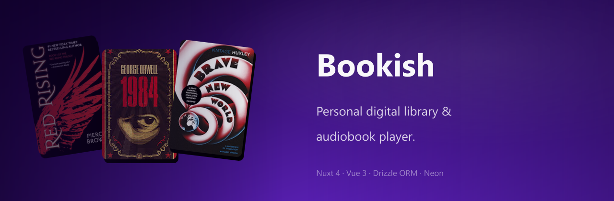
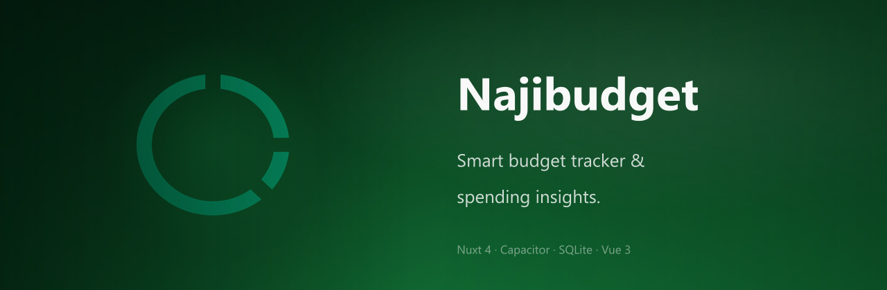
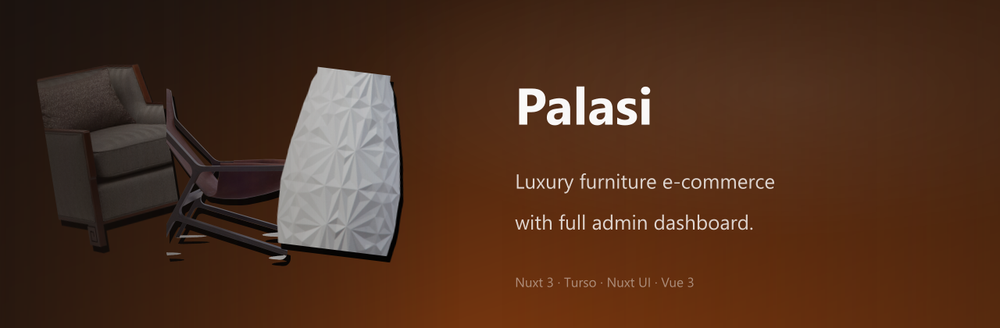
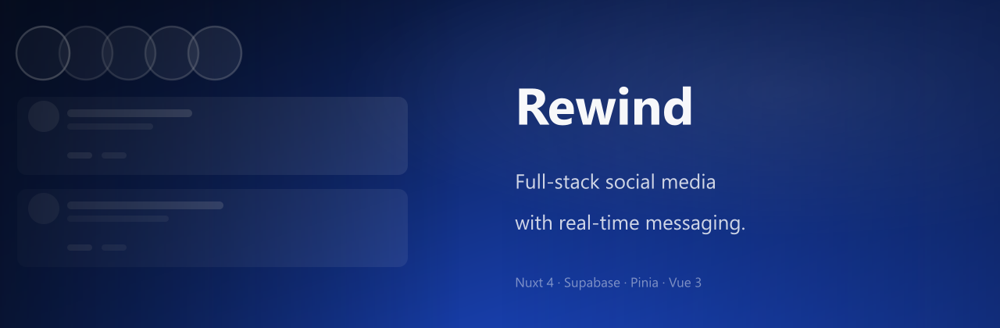

 

# Hi, I'm Jeremy 👋

**Full-stack developer who builds complete, polished web and mobile applications.** 
From social platforms to e-commerce to audiobook players — I design and ship things end to end.

 

&nbsp;

&nbsp;

 

---

## Selected Works

 

---

## Tech Stack

**Frontend**&nbsp;&nbsp;

**Backend & Data**&nbsp;&nbsp;

**Mobile & Deployment**&nbsp;&nbsp;

**Design**&nbsp;&nbsp;

 

---

## GitHub Stats

&nbsp;&nbsp;

 

---

  Nairobi, Kenya 🇰🇪

